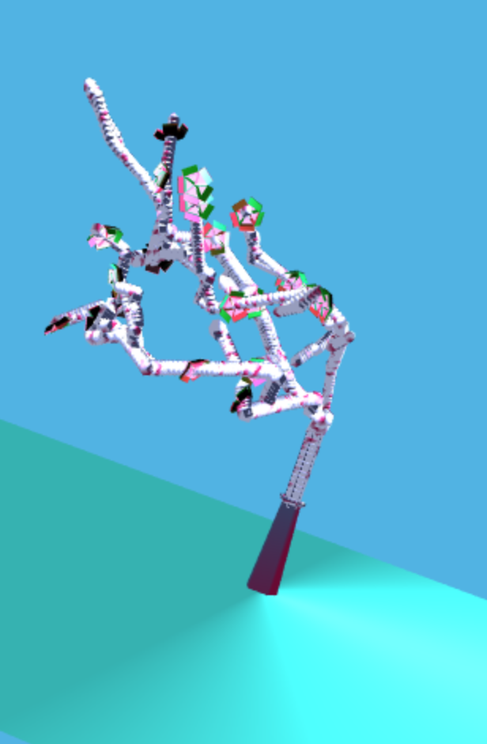

# Homework 4: L-systems

## OBJ loading
So that you can more easily generate interesting-looking plants, we ask that you
enable your program to import OBJ files and store their information in VBOs. You
can either implement your own OBJ parser, or use an OBJ-loading package via NPM:

[obj-mtl-loader](https://www.npmjs.com/package/obj-mtl-loader)

[webgl-obj-loader](https://www.npmjs.com/package/webgl-obj-loader)

## WRITE UP
Pennkey: eunsang
Name: Sang Lee

demo:  https://sangeun44.github.io/L-system/

[]
[]

## Aesthetic REQ
* Grows in 3D
* Higher probability/tendency to grow upwards
* Best is at 4th iteration
* Used webgl-obj-loader and uploaded my own 3d models
* Different shaders for flowers and the main tree
* Randomization of angles for branching and crookedness in branches
* Flowers/polyps are added

## Interactivity
*The tree re-iterates by adjusting the randomization
*The color of the coral is changeable by color selection
*You can change the number of iterations of the grammer

